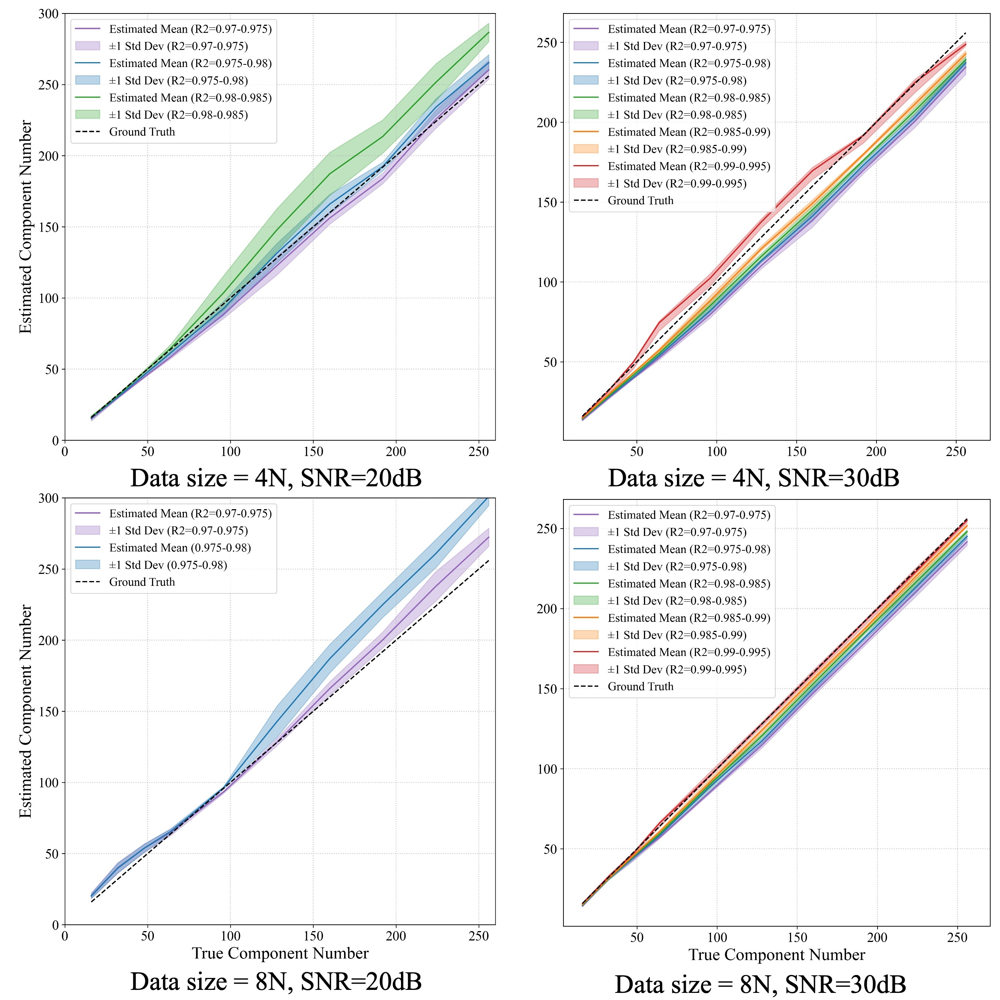

# EB-gMCR: Energy-Based Generative Multivariate Curve Resolution

Multivariate Curve Resolution (MCR),  aims to decompose mixtures of signals into their latent components and concentartions under non-unique and ill-posed settings. Traditional MCR methods typically rely on matrix factorization techniques such as MCR-ALS or NMF, which may struggle when the number of components becomes very large, data size is extremely large. Our proposed **EB-gMCR** framework leverages generative deep learning and variational optimization to provide a flexible and scalable solver for challenging large-scale MCR problems.

## 🔍 Main Result Highlights

The figure below summarizes the performance of EB-gMCR under strict testing conditions. The main target is checking accuracy of evaluated comopoennt number, becasue the solver is started from using over-paramterized components and auto-dropped by DL sovler itself. The solver is capable of accurately estimating over 256 components, and performed better when data number is large (because of its DL-based design). To our knowledge, this is the first solver that demonstrates reliable MCR behavior in such extreme settings.



This main result is fixed and robust across trials. Benchmarking against classical methods is currently under preparation for our upcoming manuscript.

## 🚀 How to Use

You can apply the EB-gMCR solver in just a few lines:

```python script
>>> import torch
>>> from ebgmcr import RandomComponentMixtureSynthesizer, DenseEBgMCR
>>> data_generator = RandomComponentMixtureSynthesizer(component_number=16, 
...                                                    component_dim=512, 
...                                                    non_negative_component=True, 
...                                                    min_concentration=1., 
...                                                    max_concentration=10., 
...                                                    signal_to_nosie_ratio=20.) # SNR in dB
>>> data = data_generator(64) # 4N dataset
>>> solver = DenseEBgMCR(num_components=1024, dim_components=512, mini_batch_size=16, device = torch.device('cuda:0'))
>>> solver.fit(data, show_eval_info = True, eval_info_display_interval = 100, log_dir = 'outputs')
Epoch: 100 | nMSE (pattern): 0.0355 | R2: 0.8337 | E: 1.5545 | Used components: 429
Epoch: 200 | nMSE (pattern): 0.0325 | R2: 0.8477 | E: 1.5434 | Used components: 408
Epoch: 300 | nMSE (pattern): 0.0279 | R2: 0.8691 | E: 1.5343 | Used components: 378
Epoch: 400 | nMSE (pattern): 0.0191 | R2: 0.9103 | E: 1.5306 | Used components: 372
Epoch: 500 | nMSE (pattern): 0.0140 | R2: 0.9346 | E: 1.5120 | Used components: 372
Epoch: 600 | nMSE (pattern): 0.0104 | R2: 0.9513 | E: 1.5082 | Used components: 374
Epoch: 700 | nMSE (pattern): 0.0070 | R2: 0.9671 | E: 1.5259 | Used components: 378
Epoch: 800 | nMSE (pattern): 0.0083 | R2: 0.9612 | E: 1.5896 | Used components: 136
Epoch: 900 | nMSE (pattern): 0.0064 | R2: 0.9702 | E: 1.5688 | Used components: 83
Epoch: 1000 | nMSE (pattern): 0.0073 | R2: 0.9657 | E: 1.5967 | Used components: 45
...
Epoch: 14300 | nMSE (pattern): 0.0050 | R2: 0.9765 | E: 0.7738 | Used components: 22
Epoch: 14377 | nMSE: 0.0050 | E: 0.7627 reach terminate condition (leave converge region).
Successfully save recorded checkpoint (region=0.97[->]0.975, effective_components=19)
Successfully checkpoint result to file:outputs/0.97[->]0.975/result.csv.
Successfully save recorded checkpoint (region=0.975[->]0.98, effective_components=21)
Successfully checkpoint result to file:outputs/0.975[->]0.98/result.csv.
>>> sovler.load_mcrs('outputs/0.975[->]0.98') # load best checkpoint
>>> result = solver.parse_pattern(data)
>>> result.keys()
dict_keys(['reconstruction', 'concentration', 'components', 'select_prob'])
```

## 🛡 License

This repository is released under the MIT License. See the [LICENSE](./LICENSE) file for details.

This is a research prototype. Use at your own risk. For inquiries about commercial use, please contact the author.
